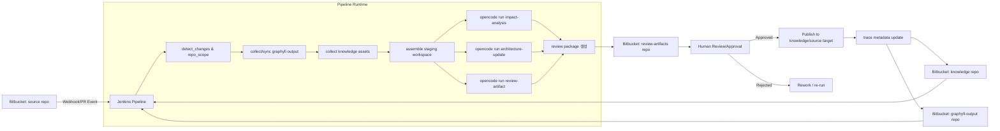
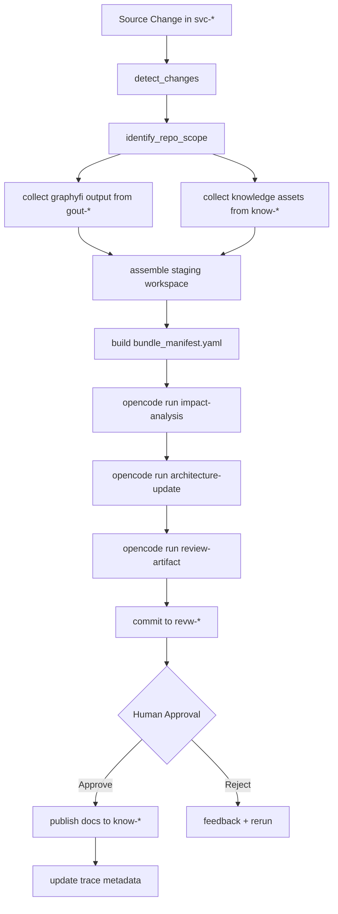

# AI KnowledgeOps + Graphyfi 기반 시스템 아키텍처 및 워크플로우 설계서 (MVP)

## 1. Executive Summary

본 문서는 Bitbucket 프로젝트 내 다중 저장소를 활용하여 **문서 + Graphyfi output + 변경 이력**을 AI 실행 컨텍스트로 통합하는 운영 체계를 정의한다. 핵심은 “문서 저장”이 아니라, 문서와 산출물을 `opencode run command`에 직접 투입 가능한 **knowledge asset**으로 표준화하는 것이다.

본 설계의 MVP는 다음을 달성한다.

- 소스 변경 발생 시 Graphyfi output과 knowledge 문서를 결합한 입력 세트를 자동/반자동으로 구성
- `opencode run command` 기반으로 영향도 분석, 아키텍처 업데이트 초안, 리뷰 산출물 생성
- Human-in-the-loop 승인 후에만 knowledge/architecture 문서 반영
- 변경 추적 메타데이터를 별도 관리하여 재현 가능성과 감사 가능성 확보

---

## 2. Problem Statement

### 2.1 현재 문제

1. 문서가 여러 저장소/위치에 흩어져 AI가 일관되게 참조하기 어려움
2. 코드 변경 후 어떤 문서/컴포넌트가 영향 받는지 추적이 어려움
3. 이슈 분석 시 로그 중심 접근으로 구조적 원인 파악이 부족함
4. 아키텍처 문서와 실제 코드/런타임 구성이 빠르게 불일치됨
5. 문서 업데이트가 수작업이라 누락/지연이 반복됨
6. 문서는 저장되지만 AI 실행 가능한 지식 체계로 운영되지 못함

### 2.2 기존 방식의 한계

- 문서 저장소 중심 운영: 검색/열람은 가능하나 자동화된 AI 실행 입력으로는 비정형
- 단일 repo 중심 CI: cross-repo 문서/분석 산출물 결합이 약함
- LLM API 직접 호출 스크립트: 프롬프트 버전/실행 재현성/감사 추적이 불명확

### 2.3 왜 Knowledge 운영 체계가 필요한가

본 시스템은 문서를 “읽을 거리”가 아닌 **실행 입력 단위(knowledge bundle)**로 다룬다.

- 문서/Graphyfi output/변경 메타를 동일한 추적 단위로 관리
- opencode 명령 실행 전 staging workspace에서 입력 세트를 명시적으로 조립
- 승인과 반영을 분리해 운영 리스크 축소

### 2.4 기대 효과

- 변경 영향 분석 속도/정확도 향상
- 아키텍처 문서 최신성 개선
- 이슈 분석 시 근거 문서 연결 자동화
- 감사 대응(누가/언제/어떤 근거로 문서 갱신했는지) 강화

### 2.5 MVP 최소 성공 기준

- 단일 서비스 repo에서 변경 이벤트 발생 시, 최소 1개 아키텍처 문서 업데이트 초안 자동 생성
- review artifact 자동 생성 + 승인 게이트 통과 후 반영
- trace metadata(커밋, 사용 knowledge, graphyfi output 버전) 누락 없이 기록

---

## 3. Design Principles

1. **Execution-first**: AI 호출은 추상적 Agent가 아니라 `opencode run command` 실행으로 표준화
2. **Repo-separation**: knowledge 문서와 graphyfi output 저장소 분리 (수명주기/권한/갱신 주기 분리)
3. **Staging-explicit**: 실행 전 복사/동기화/정규화 단계를 파이프라인에서 명시
4. **Human-gated publishing**: AI 생성 결과는 승인 전까지 생산 저장소에 직접 반영 금지
5. **Traceability-by-default**: 모든 산출물에 source commit, knowledge set, command version 연결
6. **MVP-pragmatism**: 완전 자동 연동보다 반자동 sync를 허용하고 운영 학습 우선

---

## 4. Target System Architecture

### 4.1 구성요소

- **Bitbucket Repositories**
  - source code repo
  - architecture/knowledge repo
  - graphyfi output repo
  - review artifact repo
- **CI Orchestrator**: Jenkins (또는 동급 파이프라인 실행기)
- **opencode run command execution layer**
- **Graphyfi execution/output generation 영역**
- **Knowledge assembly/staging workspace**
- **Architecture update command execution 단계**
- **Review/Approval + Human-in-the-loop 승인 단계**

### 4.2 전체 아키텍처 다이어그램



### 4.3 핵심 설계 포인트

- Vector DB/임베딩 없이 repository 파일셋 기반 knowledge 운용
- 파이프라인 중간 산출물은 모두 staging workspace에 집약
- opencode 명령별 입력 매니페스트를 생성해 실행 재현성 확보

---

## 5. Bitbucket Repository Strategy

### 5.1 저장소 분리 전략 (동일 Bitbucket Project 내)

권장 네이밍 (프로젝트 키 예: `PLAT`):

- `svc-{repo-name}`: 소스 코드
- `know-{repo-name}`: architecture/guide/reference/troubleshooting
- `gout-{repo-name}`: Graphyfi output 전용
- `revw-{repo-name}`: AI 생성 리뷰 패키지/승인 이력

대안(요청 예시 호환):

- `{repo-name}`
- `architecture-knowledge-{repo-name}`
- `graphyfi-output-{repo-name}`
- `review-artifacts-{repo-name}`

> MVP에서는 간결성과 자동 매핑을 위해 접두어 규칙(`svc-`, `know-`, `gout-`, `revw-`)을 권장.

### 5.2 repo별 역할

| Repo | 역할 | 주요 사용자 | 변경 빈도 |
|---|---|---|---|
| `svc-*` | 코드/설정/테스트 | 개발팀 | 높음 |
| `know-*` | 구조화 문서 knowledge asset | 아키텍트/개발/AI 파이프라인 | 중간 |
| `gout-*` | Graphyfi 결과 파일 | 분석 자동화/AI 파이프라인 | 중~높음 |
| `revw-*` | AI 초안, diff, 검토 체크리스트, 승인 로그 | 리뷰어/승인자 | 중간 |

### 5.3 knowledge repo와 graphyfi output repo 분리 이유

- 갱신 주기 다름: 문서는 주기적, Graphyfi output은 빌드/변경 이벤트성
- 권한 분리: Graphyfi 자동 쓰기 권한을 문서 본 repo와 분리
- 용량/이력 관리 최적화: 대형 output 파일과 문서 PR 흐름 분리

### 5.4 review-artifacts repo 분리 필요성

권장 분리. 이유:

- AI 생성 중간 산출물(초안/근거/체크리스트)과 최종 승인 문서의 경계를 명확화
- 감사 추적 강화 (승인 전후 아티팩트 보존)
- 불승인 결과가 knowledge 본 repo를 오염시키지 않음

### 5.5 repo 이름 기반 매핑 방식

매핑 규칙 예시:

- 입력: `svc-payment-api`
- 파생:
  - `know-payment-api`
  - `gout-payment-api`
  - `revw-payment-api`

파이프라인은 `svc-` 접두 제거 후 동일 suffix로 연관 repo를 계산한다.

---

## 6. Knowledge Asset Model

### 6.1 knowledge로 취급되는 파일

- 아키텍처 문서: 시스템/컴포넌트/인터페이스 설계
- 스타일 가이드: 코드/문서/리뷰 규칙
- 레퍼런스: 외부/내부 스펙 요약
- 빌드/런타임 문서: 배포/운영 설정, 런북
- 트러블슈팅: 장애 패턴, RCA, FAQ
- 리뷰 체크리스트
- Graphyfi output(별도 repo의 구조화 결과)

### 6.2 권장 포맷

- 본문: Markdown (`.md`)
- 메타데이터: YAML frontmatter + 별도 `.yaml` index
- 구조화 산출물: JSON (`.json`)

### 6.3 문서 유형 분류

| type | 설명 | 예시 파일 |
|---|---|---|
| architecture | 구조/컴포넌트/데이터 흐름 | `architecture/service-context.md` |
| style_guide | 구현/문서 작성 표준 | `guides/coding-style.md` |
| reference | 스펙/용어/정책 | `reference/domain-glossary.md` |
| build_runtime | 빌드/배포/런타임 | `runtime/deployment-model.md` |
| troubleshooting | 장애 분석/조치 | `ops/troubleshooting-db-latency.md` |
| review_checklist | 리뷰 기준 | `review/checklist-architecture.md` |
| graphyfi_output | 종속성/영향 그래프 결과 | `graphs/dependency-map.json` |

### 6.4 frontmatter 예시

```md
---
asset_id: KA-payment-arch-001
repo: payment-api
doc_type: architecture
component_tags: [api-gateway, settlement, auth]
domain_tags: [payment, compliance]
related_graphyfi_paths:
  - graphs/dependency-map.json
  - graphs/impact/impact-2026-04-15.json
related_docs:
  - KA-payment-runbook-002
review_status: approved
source_of_truth: know-payment-api
last_reviewed_at: 2026-04-10T09:30:00Z
---
```

### 6.5 knowledge asset 참조 방식

- `asset_id` 기반 참조 (문서 간 링크 + metadata index)
- `related_graphyfi_paths`로 graph output 연결
- `related_docs`로 선후행 문서 체인 구성

### 6.6 AI 입력 컨텍스트 단위

기본 단위: **Knowledge Bundle**

- `bundle_manifest.yaml`
- 관련 knowledge 문서 N개
- Graphyfi output M개
- 변경 diff 요약 1개
- 실행할 opencode command spec 1개

---

## 7. Graphyfi-Centered Workflow

### 7.1 단계별 플로우

1. source repo에서 변경 발생 (push/PR)
2. pipeline이 변경 이벤트 감지
3. Graphyfi 실행 또는 기존 output 갱신 여부 판단
4. repo 매핑으로 knowledge repo + graphyfi-output repo 파일 수집
5. staging workspace로 복사/정리
6. architecture update 입력 세트 구성
7. `opencode run command` 실행
8. 아키텍처 업데이트 초안 생성
9. 리뷰 산출물 생성 (diff, 근거, 체크리스트)
10. 사람 검토/승인

11. 승인 후 knowledge repo/target repo 반영
12. graphyfi output 및 trace metadata 갱신

#### Phase 3 실행 문서 위치 (MVP 운영)

Phase 3(파이프라인/스테이징 조립)의 실행 상세는 아래 문서를 기준으로 운영한다.

- `phase3/PHASE3_EXECUTION_PLAN.md`
- `phase3/ci-stage-definition.md`
- `phase3/staging-spec.md`
- `phase3/templates/bundle_manifest.example.yaml`
- `phase3/templates/blocked_manual_sync.example.yaml`

### 7.2 복사/붙여넣기/동기화(핵심)

MVP는 다음 방식을 허용한다.

- 자동 clone + 파일 복사:
  - `know-*`의 필요한 문서만 `staging/knowledge/`로 복사
  - `gout-*`의 최신 output을 `staging/graphyfi/`로 복사
- 반자동 수동 보완:
  - 누락 파일은 `staging/manual/`에 추가 업로드 가능
  - `bundle_manifest.yaml`에 manual source 표시
- sync 정책:
  - 실행 시점 snapshot commit hash를 매니페스트에 고정
  - 재실행 시 동일 해시 사용 또는 최신 동기화 여부 선택

### 7.3 변경 감지~반영 워크플로우 다이어그램



---

## 8. Architecture Update Workflow

### 8.1 Graphyfi output 활용

- 종속성 그래프/모듈 영향 분석 결과를 업데이트 후보 문서 선정 근거로 사용
- 변경 컴포넌트와 연관된 `asset_id` 후보 자동 추출

### 8.2 architecture update command 입력

필수 입력 세트:

- `bundle_manifest.yaml`
- `changed_files.txt`
- `graphyfi/impact-*.json`
- `knowledge/*.md`
- `review/checklist-architecture.md`

### 8.3 업데이트 대상 문서 선정 규칙

1. changed component tag와 일치하는 architecture 문서
2. Graphyfi 영향 범위 1-hop 내 컴포넌트 문서
3. 관련 runbook/troubleshooting 문서(선택)

### 8.4 AI 자동 생성 vs 사람 승인 경계

- AI 자동 생성:
  - 아키텍처 문서 초안 patch
  - 영향 근거 요약
  - 리뷰 체크리스트 pre-fill
- 사람 승인 필수:
  - source-of-truth 문서 반영 merge
  - 컴플라이언스/보안 관련 섹션 변경
  - 인터페이스 계약 변경

### 8.5 diff 검토 방식

- `revw-*` repo에 다음 파일 생성:
  - `proposed_changes.diff`
  - `rationale.md`
  - `review_checklist_filled.md`
- PR에서 코드 diff처럼 문서 diff 검토

### 8.6 traceability 기록

- 어떤 graphyfi output 파일을 근거로 썼는지
- 어떤 knowledge asset을 입력으로 썼는지
- 어떤 opencode command 버전을 사용했는지

---

## 9. Incident Analysis Workflow

### 9.1 입력 소스

- `svc-*`: 에러 로그, 최근 변경 커밋
- `know-*`: troubleshooting/runbook/architecture/reference
- `gout-*`: 의존성/영향 관계 output
- `revw-*`: 최근 미반영/반려된 변경 맥락

### 9.2 Knowledge-assisted 분석 흐름

1. incident ticket 생성 및 commit 범위 확정
2. 관련 로그 + 최근 변경 파일 수집
3. Graphyfi output으로 영향 모듈 우선순위 계산
4. knowledge 문서 후보 자동 매핑
5. `opencode run incident-analysis` 실행
6. 분석 결과를 review artifact로 저장 후 사람 검토

### 9.3 출력물 정의

- 관련 문서 후보 목록
- 영향받는 모듈/컴포넌트
- 의심 변경 포인트(커밋/파일/설정)
- 확인 체크리스트
- fix vs rollback 판단 근거

---

## 10. opencode Command Execution Model

### 10.1 명령 카탈로그 (예시)

| 작업 | opencode command 예시 | 출력 |
|---|---|---|
| 영향도 분석 | `opencode run impact-analysis --manifest staging/bundle_manifest.yaml` | `impact_report.md`, `impact.json` |
| 아키텍처 업데이트 | `opencode run architecture-update --manifest staging/bundle_manifest.yaml` | `architecture_patch.md`, `rationale.md` |
| 리뷰 산출물 생성 | `opencode run review-artifact --input staging/results/` | `proposed_changes.diff`, `review_packet.md` |
| 이슈 분석 | `opencode run incident-analysis --manifest staging/incident_manifest.yaml` | `incident_assessment.md`, `suspected_points.json` |

### 10.2 staging workspace 구성 절차

1. `workspace/run-{pipeline_id}/` 생성
2. repo clone (`svc`, `know`, `gout`)
3. 파일 선택 복사 (`cp`/rsync)
4. 매니페스트 생성
5. command 실행
6. 결과물을 `revw-*` 반영

### 10.3 결과 저장 위치

- 1차 결과: Jenkins workspace
- 검토 결과: `revw-*`
- 승인 후 반영: `know-*` (필요 시 `svc-*`의 docs 경로)

### 10.4 실패/재실행/보류 전략

- command 실패: 동일 manifest로 1회 재시도
- 입력 누락: `status=blocked_manual_sync`로 보류
- Graphyfi stale: `gout-*` 최신화 job 선실행 후 재개
- 반복 실패: reviewer 할당 + 수동 실행 모드 전환

---

## 11. Metadata Model

### 11.1 핵심 메타데이터 필드

- repository name
- source repository mapping
- knowledge asset id
- document type
- component/domain tags
- related graphyfi output path
- related architecture doc
- review status
- generated by / reviewed by
- source commit hash
- generated timestamp

### 11.2 YAML 예시

```yaml
trace_record_id: TR-payment-api-20260415-001
repository:
  source_repo: svc-payment-api
  knowledge_repo: know-payment-api
  graphyfi_repo: gout-payment-api
  review_repo: revw-payment-api
source_commit_hash: "8f3c1e9"
knowledge_bundle:
  bundle_id: KB-payment-api-20260415-a
  assets:
    - asset_id: KA-payment-arch-001
      doc_type: architecture
      path: architecture/service-context.md
      component_tags: [gateway, settlement]
    - asset_id: KA-payment-troubleshoot-004
      doc_type: troubleshooting
      path: ops/troubleshooting-timeout.md
      component_tags: [gateway]
graphyfi_inputs:
  - path: graphs/dependency-map-20260415.json
  - path: graphs/impact/impact-8f3c1e9.json
related_architecture_doc: architecture/service-context.md
execution:
  opencode_command: "opencode run architecture-update --manifest staging/bundle_manifest.yaml"
  generated_by: ci-bot
  generated_timestamp: "2026-04-15T10:42:00Z"
review:
  review_status: pending
  reviewed_by: null
  review_timestamp: null
```

### 11.3 JSON 예시

```json
{
  "trace_record_id": "TR-payment-api-20260415-001",
  "source_repository_mapping": {
    "source": "svc-payment-api",
    "knowledge": "know-payment-api",
    "graphyfi_output": "gout-payment-api",
    "review_artifacts": "revw-payment-api"
  },
  "document_type": "architecture",
  "knowledge_asset_id": "KA-payment-arch-001",
  "component_tags": ["gateway", "settlement"],
  "domain_tags": ["payment"],
  "related_graphyfi_output_path": "graphs/impact/impact-8f3c1e9.json",
  "review_status": "approved",
  "generated_by": "ci-bot",
  "reviewed_by": "architect-a",
  "source_commit_hash": "8f3c1e9",
  "generated_timestamp": "2026-04-15T10:42:00Z"
}
```

---

## 12. CI Pipeline Design

### 12.1 Stage 설계

| Stage | 입력 | 출력 | 실패 처리 | 보류 전략 |
|---|---|---|---|---|
| detect_changes | source webhook, commit range | changed files list | 이벤트 파싱 실패 시 종료 | 재트리거 |
| identify_repo_scope | source repo name | know/gout/revw repo mapping | 매핑 실패 시 fail | 수동 매핑 등록 후 재실행 |
| update_or_collect_graphyfi_output | changed files, gout repo | 최신 graphyfi output | 생성 실패 시 이전 안정버전 사용 | stale 플래그 설정 |
| collect_knowledge_assets | know repo, mapping rules | selected knowledge files | 파일 누락 시 warning | manual sync 대기 |
| assemble_staging_workspace | collected files | staging bundle | manifest 불일치 시 fail | bundle 검수 후 재실행 |
| run_opencode_architecture_update | staging manifest | architecture draft | command 실패 시 1회 재시도 | blocked 상태 전환 |
| generate_review_artifacts | draft/results | diff, rationale, checklist | 생성 실패 시 fail | 수동 리뷰 패킷 작성 |
| human_approval | review packet | approve/reject | 승인 타임아웃 | SLA 초과 알림 |
| publish_to_repo | approval + artifacts | merged docs | merge 충돌 | rebase 후 재승인 |
| update_trace_metadata | all run context | trace yaml/json | 기록 실패 시 fail | 메타만 재시도 job |

### 12.2 Jenkinsfile 형태 예시

```groovy
pipeline {
  agent any
  stages {
    stage('detect_changes') { steps { sh './ci/detect_changes.sh' } }
    stage('identify_repo_scope') { steps { sh './ci/identify_repo_scope.sh' } }
    stage('update_or_collect_graphyfi_output') { steps { sh './ci/collect_graphyfi.sh' } }
    stage('collect_knowledge_assets') { steps { sh './ci/collect_knowledge.sh' } }
    stage('assemble_staging_workspace') { steps { sh './ci/assemble_staging.sh' } }
    stage('run_opencode_architecture_update') { steps { sh './ci/run_opencode_arch_update.sh' } }
    stage('generate_review_artifacts') { steps { sh './ci/generate_review_artifacts.sh' } }
    stage('human_approval') { steps { input message: 'Approve architecture update?' } }
    stage('publish_to_repo') { steps { sh './ci/publish_docs.sh' } }
    stage('update_trace_metadata') { steps { sh './ci/update_trace_metadata.sh' } }
  }
}
```

---

## 13. MVP Rollout Plan

### 13.1 MVP 범위

- 저장소 최소 분리: `svc-*`, `know-*`, `gout-*` (초기에는 `revw-*`를 `know-*` 내 `review/` 폴더로 대체 가능)
- repo 간 복사/조합: 자동 clone + 수동 보강 허용
- Graphyfi output 최소 활용: dependency map + impact file 2종
- 첫 자동화 문서 유형: architecture 문서 1종 + review checklist

### 13.2 첫 성공 사례(예시)

- 대상: `svc-payment-api`
- 상황: settlement 모듈 리팩토링
- 결과:
  - 영향 분석 보고서 자동 생성
  - `know-payment-api/architecture/service-context.md` 업데이트 초안 생성
  - 리뷰 승인 후 반영 + trace metadata 기록 완료

### 13.3 확장 방향

1. `revw-*` 분리 저장소 정식 도입
2. incident-analysis 자동화 연계 강화
3. 수동 sync 비율 축소(자동 선택 규칙 고도화)
4. 다중 서비스 dependency 연쇄 분석으로 확대

### 13.4 MVP 즉시 적용 운영 규칙 (리뷰 반영)

MVP 단계에서는 고도화 이전에 아래 3가지를 최소 운영 규칙으로 고정한다.

1. **입력 완전성 최소 검증 (MVP Validator)**
   - `bundle_manifest.yaml`, `changed_files.txt`, `graphyfi/impact-*.json`, `knowledge/*.md` 존재 여부를 실행 전 검사
   - 누락 시 파이프라인을 즉시 중단하고 `status=blocked_manual_sync`로 전환

2. **수동 동기화 출처 기록 의무화**
   - `staging/manual/`에 추가된 모든 파일은 `bundle_manifest.yaml`에 `manual_source`, `added_by`, `added_at` 필드로 기록
   - 출처 미기록 파일은 실행 입력에서 제외

3. **실패 처리 단순화**
   - `opencode run command` 실패 시 동일 manifest로 1회만 재시도
   - 재실패 시 자동 반영을 중단하고 reviewer 수동 검토 큐로 이관

위 3가지 규칙은 본 문서의 `7.2 복사/붙여넣기/동기화`, `8.2 architecture update command 입력`, `10.4 실패/재실행/보류 전략`을 MVP 운영 기준으로 구체화한 것이다.

---

## 14. Risks and Mitigations

| 리스크 | 설명 | 대응 방안 |
|---|---|---|
| knowledge 최신성 저하 | 문서 갱신 지연 | 문서 freshness SLA + 만료 태그 |
| repo 간 정합성 불일치 | source/know/gout 버전 미스매치 | manifest에 각 repo commit hash 고정 |
| graphyfi stale | 오래된 output 사용 | stale 기준일 초과 시 실행 차단 |
| 잘못된 근거 문서 사용 | AI가 비관련 문서 참조 | asset tagging + reviewer 검증 체크리스트 |
| 승인 없는 반영 | 자동 merge 오남용 | human_approval mandatory gate |
| staging 누락/혼선 | 파일 복사 누락 | bundle completeness validator |
| command 실행 실패 | opencode runtime 오류 | 재시도 1회 + blocked 상태 + 수동 경로 |
| repo 운영 복잡도 증가 | 저장소 다수 관리 부담 | naming convention + 템플릿 repo + 운영 대시보드 |

---

## 15. Appendix

### 15.1 Repository 구조 예시 (tree)

```text
PLAT/
├── svc-payment-api/
│   ├── src/
│   ├── configs/
│   └── ci/
├── know-payment-api/
│   ├── architecture/
│   │   ├── service-context.md
│   │   └── component-interactions.md
│   ├── guides/
│   │   └── coding-style.md
│   ├── ops/
│   │   └── troubleshooting-timeout.md
│   ├── review/
│   │   └── checklist-architecture.md
│   └── metadata/
│       └── knowledge-index.yaml
├── gout-payment-api/
│   ├── graphs/
│   │   ├── dependency-map-20260415.json
│   │   └── impact/
│   │       └── impact-8f3c1e9.json
│   └── metadata/
│       └── graphyfi-run-log.yaml
└── revw-payment-api/
    ├── runs/
    │   └── 20260415-104200/
    │       ├── proposed_changes.diff
    │       ├── rationale.md
    │       └── review_checklist_filled.md
    └── metadata/
        └── trace-records.yaml
```

### 15.2 staging workspace 예시

```text
workspace/run-20260415-1042/
├── input/
│   ├── source/
│   ├── knowledge/
│   ├── graphyfi/
│   └── changed_files.txt
├── manifest/
│   └── bundle_manifest.yaml
└── output/
    ├── impact_report.md
    ├── architecture_patch.md
    └── review_packet.md
```

### 15.3 운영 체크리스트 (요약)

- repo naming 규칙 준수 여부
- bundle manifest의 commit hash 4종(source/know/gout/review) 기록 여부
- human approval 없이 publish stage 진입 차단 여부
- trace metadata 누락 없는지 검증

---

## 16. Phase 1 산출물 (2026-04-15)

Phase 1(Foundation & Governance) 확정 산출물:

- 운영 규칙서: `governance/phase1/phase1-operating-rules.md`
- 리뷰/승인 책임 매트릭스(RACI): `governance/phase1/phase1-review-approval-raci.md`

본 산출물은 다음 항목을 확정한다.

1. `svc/know/gout/revw` 네이밍 및 매핑 규칙
2. `human_approval` 게이트 정책과 publish 차단 조건
3. 문서 taxonomy (`architecture/style_guide/reference/build_runtime/troubleshooting/review_checklist`)
